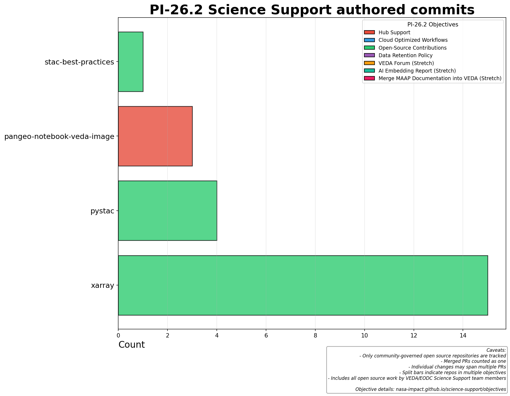
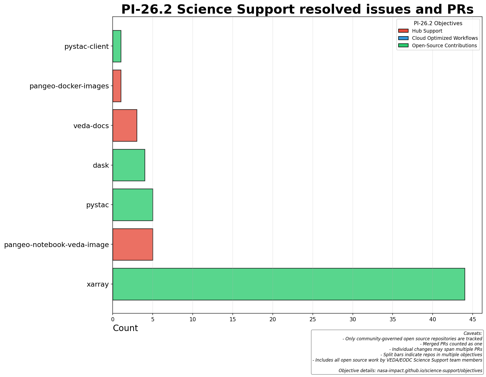

# Quarterly Objectives

This page tracks quarterly objectives and their related repositories across Program Increments (PIs).

## Current PI: 26.2

| # | Objective | Contributors | Repos |
|---|-----------|--------------|-------|
| [#1](https://github.com/NASA-IMPACT/science-support/issues/1) | Hub Support | wildintellect, jsignell | repo2docker-action, pangeo-docker-images, veda-docs, pangeo-notebook-veda-image |
| [#2](https://github.com/NASA-IMPACT/science-support/issues/2) | Cloud Optimized Workflows |  | - |
| [#3](https://github.com/NASA-IMPACT/science-support/issues/3) | Open-Source Contributions | jsignell, tylanderson | stac-best-practices, stac-spec, dask, pystac, pystac-client, xarray |

---

---

## Visualization

The charts use color-coding to show which objective each repo contributes to. Repos that contribute to multiple objectives are shown with split bars.





---

## Configuration

Objectives are configured in [`reports/config.py`](https://github.com/NASA-IMPACT/science-support/blob/main/reports/config.py).

To regenerate this page from config:

```bash
cd reports
uv run generate_docs.py
```