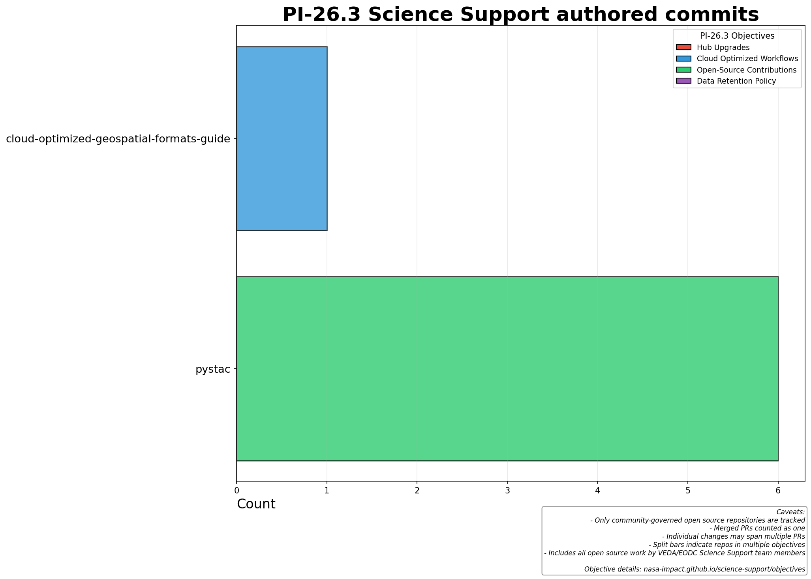
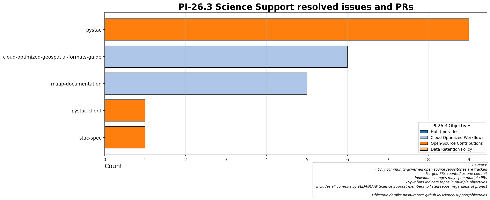
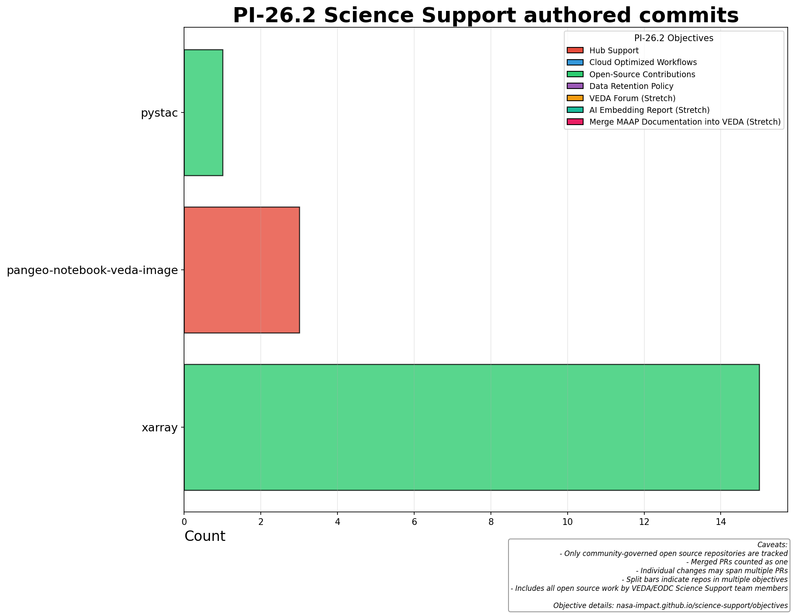
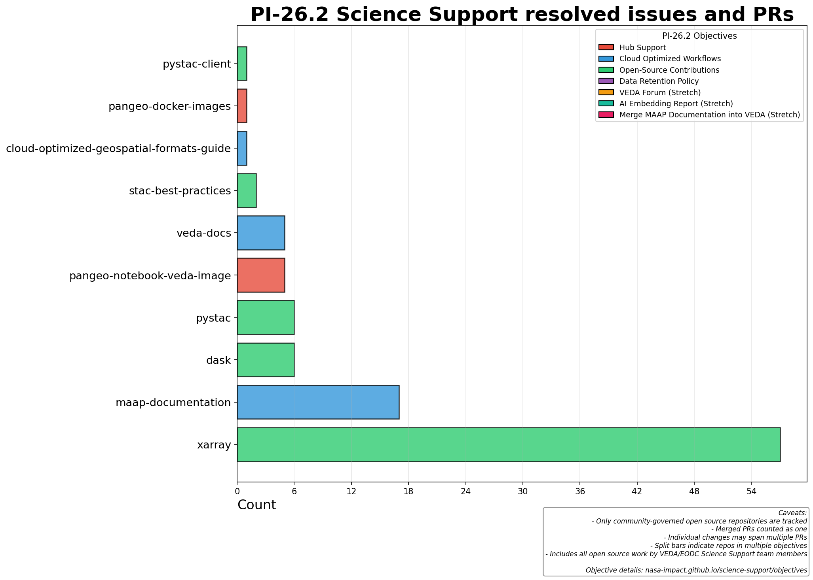

# Quarterly Objectives

This page tracks quarterly objectives for the VEDA/MAAP Science Support team and the open-source repositories they touch across Program Increments (PIs).

## Current PI: 26.3





| # | Objective | Contributors | Repos |
|---|-----------|--------------|-------|
| [#31](https://github.com/NASA-IMPACT/science-support/issues/31) | Hub Upgrades | wildintellect, grallewellyn | repo2docker-action, pangeo-docker-images, pangeo-notebook-veda-image |
| [#32](https://github.com/NASA-IMPACT/science-support/issues/32) | Cloud Optimized Workflows | wildintellect, tylanderson | veda-docs, maap-documentation, cloud-optimized-geospatial-formats-guide |
| [#33](https://github.com/NASA-IMPACT/science-support/issues/33) | Open-Source Contributions | gadomski, tylanderson | stac-best-practices, stac-spec, dask, pystac, pystac-client, xarray |
| [#34](https://github.com/NASA-IMPACT/science-support/issues/34) | Data Retention Policy | smk0033 | - |

---

## Past PIs

<details markdown>
<summary>PI 26.2 (7 original objectives; 4 closed as completed; 3 closed as not planned)</summary>

| # | Objective | State | Contributors |
|---|-----------|-------|--------------|
| [#1](https://github.com/NASA-IMPACT/science-support/issues/1) | Hub Support | closed (completed) | wildintellect, jsignell |
| [#2](https://github.com/NASA-IMPACT/science-support/issues/2) | Cloud Optimized Workflows | closed (completed) | wildintellect, jsignell |
| [#3](https://github.com/NASA-IMPACT/science-support/issues/3) | Open-Source Contributions | closed (completed) | jsignell, ircwaves, tylanderson |
| [#9](https://github.com/NASA-IMPACT/science-support/issues/9) | Data Retention Policy | closed (completed) | smk0033 |
| [#10](https://github.com/NASA-IMPACT/science-support/issues/10) | VEDA Forum (Stretch) | closed (not planned) | smk0033 |
| [#11](https://github.com/NASA-IMPACT/science-support/issues/11) | AI Embedding Report (Stretch) | closed (not planned) | omshinde |
| [#12](https://github.com/NASA-IMPACT/science-support/issues/12) | Merge MAAP Documentation into VEDA (Stretch) | closed (not planned) | - |





</details>

---

## Configuration

Objectives data lives in [`reports/_objectives_data.py`](https://github.com/NASA-IMPACT/science-support/blob/main/reports/_objectives_data.py) — auto-generated from GitHub issues by `dse_oss_reports.generator.ObjectivesGenerator`.

To regenerate this page:

```bash
cd reports
uv run generate_docs.py
```
