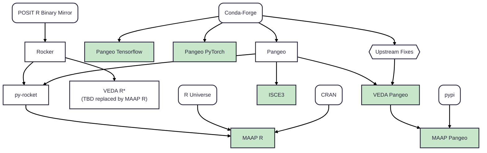

- Ovals - Sources
- Rectangles - Docker Container images
- Green Rectangles - Images deployed on MAAP or VEDA

```mermaid
---
config:
  theme: redux
  layout: dagre
---
flowchart TB
    n1["Conda-Forge"] --> n6["Pangeo"] & n16["Pangeo Tensorflow"] & n17["Pangeo PyTorch"]
    n2["POSIT R Binary Mirror"] --> n7["Rocker"]
    n7 --> n8["py-rocket"] & n13["VEDA R*<br>(TBD replaced by MAAP R)"]
    n6 --> n8 & n9["VEDA Pangeo"] & n14["ISCE3"]
    n9 --> n10["MAAP Pangeo"]
    n11["Upstream Fixes"] --> n9
    n4["pypi"] --> n10
    n8 --> n12["MAAP R"]
    n5["R Universe"] --> n12
    n3["CRAN"] --> n12
    n1 --> n11

    n1@{ shape: rounded}
    n2@{ shape: rounded}
    n11@{ shape: hex}
    n4@{ shape: rounded}
    n5@{ shape: rounded}
    n3@{ shape: rounded}
    style n16 fill:#C8E6C9
    style n17 fill:#C8E6C9
    style n9 fill:#C8E6C9
    style n14 fill:#C8E6C9
    style n10 fill:#C8E6C9
    style n12 fill:#C8E6C9
```
